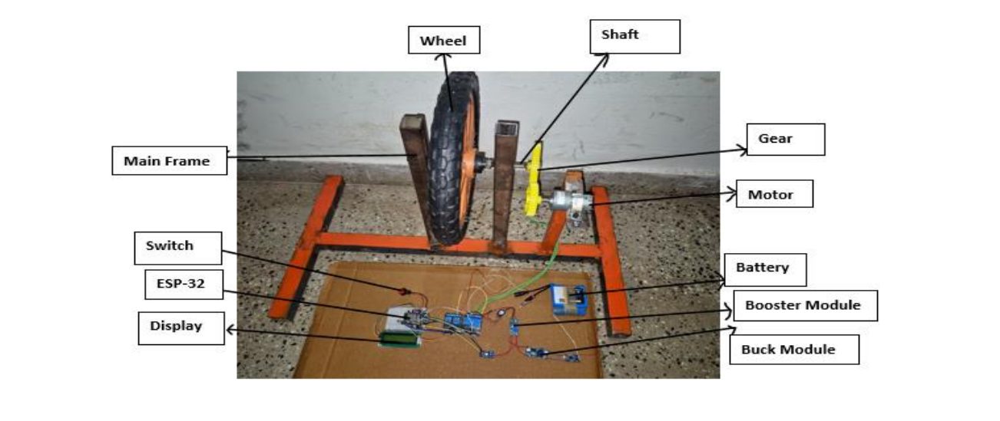
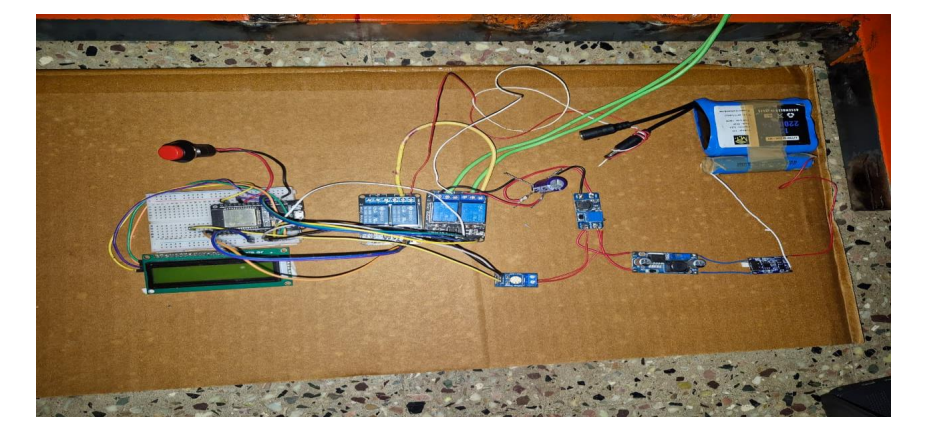

# Low-Cost Regenerative Braking System for Two-Wheelers

## Abstract

This project presents the design and fabrication of a low-cost regenerative braking system for two-wheelers. The system recovers kinetic energy during braking and converts it into electrical energy using a DC motor operating in generator mode. The recovered energy is regulated and stored efficiently, improving overall energy utilization.

This project demonstrates a practical and low-cost alternative to regenerative braking systems used in modern electric vehicles.

---

## Introduction

In conventional braking systems, kinetic energy is dissipated as heat. Regenerative braking offers a solution by converting this energy into usable electrical power. While widely used in electric cars, such systems are rarely implemented in two-wheelers due to cost and complexity.

This project focuses on developing a simple, affordable, and scalable regenerative braking system.

---

## Objectives

* Design a low-cost regenerative braking mechanism
* Recover and store energy during braking
* Ensure safe and stable voltage regulation
* Demonstrate practical feasibility using a prototype

---

## Methodology

A flywheel-based model was used to simulate a two-wheeler wheel. A DC motor was coupled to the wheel, which acts as a generator during braking. The generated voltage is regulated using a buck–boost converter and directed to a battery for storage.

### System Components

* Flywheel (cycle tyre) for rotational simulation
* DC motor for energy generation
* Buck–boost converter for voltage regulation
* Relay module for switching between modes
* ESP32 microcontroller for monitoring and control

---

## Working Principle

When braking is applied, the rotational motion of the wheel drives the DC motor in generator mode. The generated electrical energy varies with speed, so a buck–boost converter stabilizes the output voltage.

A relay controlled by ESP32 ensures proper switching between normal operation and regenerative mode. The regulated energy is stored in a battery.

---

## Results and Discussion

The prototype successfully demonstrated energy recovery during braking.

### Key Observations

* Electrical energy generation proportional to wheel speed
* Stable voltage output using buck–boost converter
* Effective battery charging even at low speeds
* Reliable switching between operating modes

The system proves that regenerative braking can be implemented using simple and affordable components.

---

## Cost Analysis

The total cost of the system is approximately **₹1750**, making it a highly economical solution compared to commercial regenerative braking systems.

---

## Advantages

* Low-cost implementation
* Simple design and easy integration
* Improved energy efficiency
* Reduced energy loss during braking

---

## Limitations

* Lower efficiency compared to commercial systems
* Suitable mainly for demonstration and small-scale applications
* Mechanical losses in prototype setup

---

## Future Scope

* Integration with BLDC hub motors for higher efficiency
* Use of solid-state switching (MOSFET/IGBT)
* Implementation of advanced control algorithms
* Hybrid energy storage using batteries and supercapacitors
* Real-time monitoring using IoT systems

---

## Conclusion

The project successfully demonstrates that regenerative braking can be implemented in two-wheelers using low-cost components. The system shows promising potential for improving energy efficiency in small electric vehicles while maintaining simplicity and affordability.

---

## Contribution

This project was developed as part of a group academic project.

My contributions included:

* Understanding system design and regenerative braking principles
* Assisting in prototype setup and testing
* Supporting documentation and analysis

---

## Images

